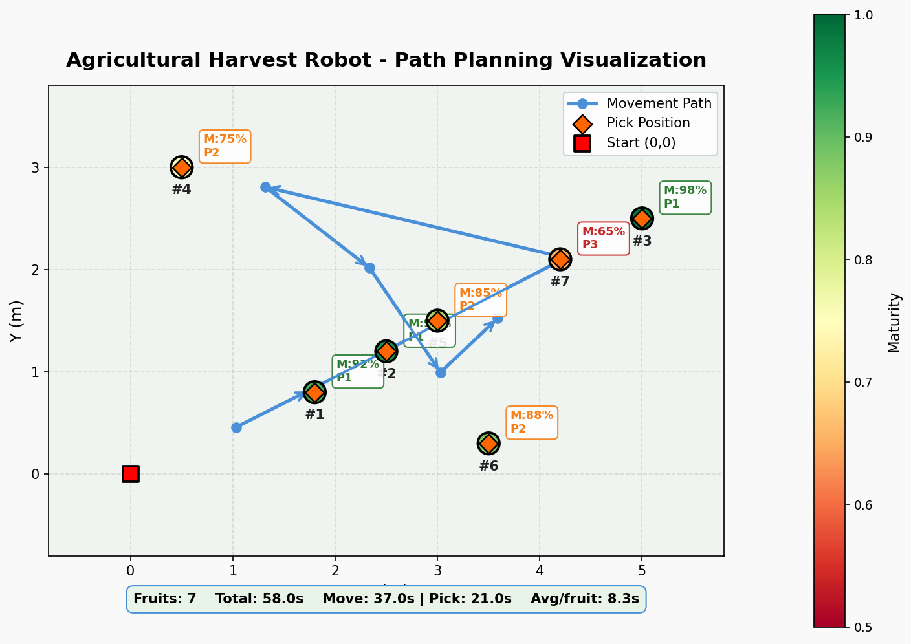

# agriculture-robot-planner

农业机器人智能规划系统 — 采摘/播种/灌溉 + GPS路径预测 + 多源数据接入

[](https://www.python.org/)


## 端到端性能

| 指标 | 结果 |
|------|------|
| 测试果实数 | 7 个 |
| 总动作数 | 14 步 |
| 总耗时 | 58 秒 |
| **平均单果耗时** | **8.3 秒** |
| 测试通过率 | 21/21 (100%) |



*7个果实目标，14步动作，58秒完成（平均单果8.3秒）。颜色深浅表示成熟度，箭头为机器人移动轨迹。*

## 模块一览

| 文件 | 功能 |
|------|------|
| `harvesting_robot_planner.py` | 采摘路径规划 + 农民避障 + 安全状态 |
| `real_data_interface.py` | GPS/摄像头/传感器多源数据接口层 |
| `fruit_maturity_detector.py` | 果实成熟度检测 (HSV颜色分析) |
| `smart_sowing_planner.py` | 智能播种规划 (密度优化+路径生成) |
| `smart_irrigation_planner.py` | 智能灌溉规划 |
| `test_end_to_end.py` | **端到端集成测试** (6阶段, 21项断言) |

## 快速开始

```bash
# 运行集成测试（验证全链路）
python test_end_to_end.py

# 带可视化输出
python test_end_to_end.py --viz

# 带中文动作解释
python test_end_to_end.py --explain

# 单独运行采摘规划器演示
python harvesting_robot_planner.py
```

## 端到端测试流程

```
数据生成 → GPS轨迹加载 → 农民路径预测 → 目标检测 → 路径规划(带避障) → 效率统计 → 安全检查
```

测试覆盖6个阶段：初始化、GPS轨迹、农民避障、目标检测、路径规划、效率统计。

## 依赖

- Python 3.8+
- numpy
- opencv-python (用于 real_data_interface 摄像头模块)
